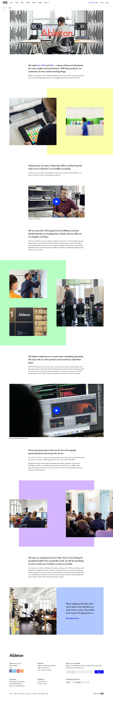

# Challenge by Frontend Practice: "Landing Page for Ableton"

## Table of Contents

- [Challenge by Frontend Practice: "Landing Page for Ableton"](#challenge-by-frontend-practice-landing-page-for-ableton)
  - [Table of Contents](#table-of-contents)
  - [About the project](#about-the-project)
  - [Screenshots](#screenshots)
    - [Referece image:](#referece-image)
    - [Final result](#final-result)
  - [Links](#links)
  - [Built with](#built-with)
  - [Author](#author)

## About the project

- Custom Typography
- CSS Modules
- React components
- Variables in CSS
- Vite as a bundler and dev server for React

## Screenshots

### Referece image:

### Final result

## Links

- Repo: [Here](#)
- Deploy: [Here](#)
- Design provide by Frontend Practice [Here!](https://www.frontendpractice.com/projects/ableton)

## Built with

- HTML5
- CSS3 
- Modern Javascript
- React & ReactDOM
- Vite.js
- Dompurify (sanitize HTML) 

## Author

- Github: [https://github.com/creativoma](https://github.com/creativoma)
- Linkedin: [https://www.linkedin.com/in/ma-marianoalvarez/](https://www.linkedin.com/in/ma-marianoalvarez/)
